<p align="center">
  
</p>

# `> whoami`

**Jay / Ghotet**  
**AI Systems Designer · Computer Science student · Game-design brain with too many ideas**

I build AI systems, tools, and increasingly questionable experiments involving local models.

My background is in **game design and development**. I’ve built my own games solo, but the design side is probably what most shaped how I think about software.

I care less about isolated chunks of code and more about:

`systems → state → behavior → interaction → emergent chaos`

These days I mostly design the architecture, bully prototypes until they work, and delegate the actual typing to a small army of AI tools.

> **Methodology:** I don't code, I delegate.

---

# `> current_project`

## 🜏 Daemonic

A local-first AI platform that started as a tiny experiment and somehow became an attempt to build an entire persistent AI ecosystem.

Current areas of obsession:

```text
Native LLM inference      █████████░
Context + memory          ████████░░
Persistent AI agents      ███████░░░
Generative media          ██████░░░░
Voice / personality       █████░░░░░
AI desktop / shell        ████░░░░░░
Knowing when to stop      █░░░░░░░░░
```

*Progress bars are scientifically meaningless and emotionally accurate.*

The long-term idea is simple enough:

> **What if the AI actually owned its stack?**

Native inference, persistent identity, long-term memory, tools, files, images, voices, multiple agents, and eventually an AI-native desktop environment where they can exist and interact instead of living inside one chat box.

This has gotten slightly out of hand.

---

# `> other_experiments`

## 🔌 GPTBridge

A bridge between cloud AI and my local machine.

It grew out of wanting an AI to do more than return text: talk to local generative tools, work with media, manage jobs, and generally reach through the browser without giving the entire internet unrestricted access to my PC.

Turns out "just connect the AI to a few things" is how software projects reproduce.

## 🎮 Game-design + development roots

Game design is still how I tend to approach software.

I'm usually thinking about:

- how systems affect each other
- how state persists
- what the user experiences
- what happens when something breaks
- how individual mechanics combine into something larger
- whether the whole thing is actually fun to use

I care about the architecture because I care about the behavior that emerges from it.

Writing the individual function has never been the bit that excites me.

---

# `> philosophy`

I like software that is modular, portable, replaceable, and actually belongs to the person using it.

**Dependencies should be tools, not landlords.**

If some piece of software annoys me for long enough, there is a **non-zero chance I will eventually try to replace it with my own version.**

This has historically been a terrible way to reduce the number of projects I have.

---

# `> status`

```text
location       Ontario, Canada
studying       Computer Science
building       Daemonic
methodology    I don't code, I delegate
preferred OS   whichever one annoyed me least today
local AI       yes
scope control  no
uptime         questionable
```

---

# `> operating_procedure`

```text
1. have idea
2. explain idea to AI
3. accidentally design an entire subsystem
4. delegate implementation
5. test it
6. discover something cursed
7. fix cursed thing
8. have another idea before finishing the first one
9. repeat
```

---

<p align="center">
  <code>ghotet@github:~$ █</code>
</p>
